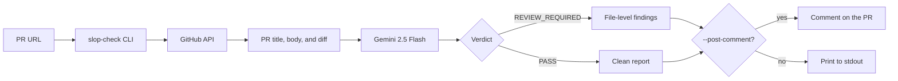
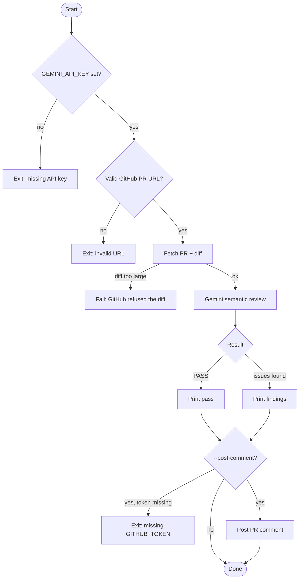
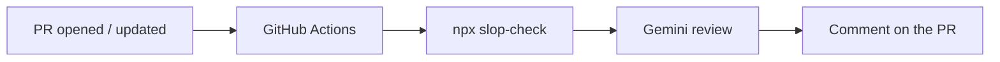

# slop-check

**Semantic AI review for GitHub pull requests.**

`slop-check` is a CLI that reads a PR diff the way a strict maintainer would: it flags low-effort AI-generated code, hallucinated APIs, bugs, and architectural smells using Google Gemini.

[](https://www.npmjs.com/package/@prathmesh2402/slop-check)
[](https://github.com/prathmeshkulkarni-coder/slop-check)
[](https://nodejs.org/)

```bash
npx @prathmesh2402/slop-check pr https://github.com/owner/repo/pull/123
```

---

## Why this exists

Line-count heuristics miss the real problem. A 12-line PR can invent an API that does not exist. A 400-line PR can be a clean, well-tested fix.

`slop-check` sends the actual diff to Gemini and asks for a pass/fail judgment with file-level findings. Use it locally before you review, or wire it into GitHub Actions so every PR gets a first-pass comment automatically.

---

## How it works



1. Parse the PR URL (`owner`, `repo`, `number`).
2. Fetch metadata and the unified diff from the GitHub API.
3. Truncate the diff to 50,000 characters and send it to Gemini with a strict review prompt.
4. Print `PASS` or a detailed `REVIEW_REQUIRED` report.
5. Optionally post that report as a GitHub comment.



---

## Features

| Capability | What it does |
|---|---|
| Semantic review | Reads the diff with Gemini 2.5 Flash instead of scoring churn |
| Strict verdict | Returns `PASS` only when no slop, bugs, or smells are found |
| File-level findings | Each issue includes file, line, problem type, and a suggested fix |
| Auto-comment | `--post-comment` writes the report onto the PR |
| CI-ready | Runs from `npx` in GitHub Actions with no custom action required |
| Local-first secrets | `GEMINI_API_KEY` stays in `.env` or GitHub Secrets — never in the published package |

---

## Security

This tool sends PR diffs to the Google Gemini API.

| Repository type | Recommendation |
|---|---|
| Public open-source | Safe to use |
| Private or proprietary | Do not use — source leaves your infrastructure |

- Store `GEMINI_API_KEY` in `.env` locally or in GitHub Actions secrets.
- Without `GITHUB_TOKEN`, the GitHub API is limited to **60 requests/hour per IP**.
- `GITHUB_TOKEN` is required only when posting a comment.

---

## Installation

```bash
# Global install
npm install -g @prathmesh2402/slop-check

# One-off, no install
npx @prathmesh2402/slop-check pr <github-pr-url>
```

From source:

```bash
git clone https://github.com/prathmeshkulkarni-coder/slop-check.git
cd slop-check
npm install
npm run build
```

---

## Usage

### Local analysis

```bash
export GEMINI_API_KEY="your-gemini-api-key"
npx @prathmesh2402/slop-check pr https://github.com/owner/repo/pull/123
```

### Post the review as a PR comment

```bash
export GEMINI_API_KEY="your-gemini-api-key"
export GITHUB_TOKEN="your-github-token"
npx @prathmesh2402/slop-check pr https://github.com/owner/repo/pull/123 --post-comment
```

### CLI

```
slop-check pr <url> [--post-comment]
```

| Argument / flag | Description |
|---|---|
| `<url>` | GitHub PR URL: `https://github.com/owner/repo/pull/123` |
| `--post-comment` | Post the review as a comment on the PR |

---

## GitHub Actions



1. Add `GEMINI_API_KEY` under **Settings → Secrets and variables → Actions**.
2. Commit `.github/workflows/slop-check.yml`:

```yaml
name: slop-check

on:
  pull_request:
    types: [opened, synchronize, reopened]

jobs:
  review:
    runs-on: ubuntu-latest
    permissions:
      contents: read
      pull-requests: write
    steps:
      - name: Setup Node.js
        uses: actions/setup-node@v4
        with:
          node-version: '20'

      - name: Run slop-check
        env:
          GEMINI_API_KEY: ${{ secrets.GEMINI_API_KEY }}
          GITHUB_TOKEN: ${{ secrets.GITHUB_TOKEN }}
        run: npx --yes @prathmesh2402/slop-check pr ${{ github.event.pull_request.html_url }} --post-comment
```

---

## Environment variables

| Variable | Required | Description |
|---|---|---|
| `GEMINI_API_KEY` | Always | Free key from [Google AI Studio](https://aistudio.google.com/app/apikey) |
| `GITHUB_TOKEN` | With `--post-comment` | Personal access token locally, or `secrets.GITHUB_TOKEN` in Actions |

---

## Limits

| Limit | Behavior |
|---|---|
| Diff larger than ~20,000 lines | GitHub refuses the diff; slop-check fails and asks for a manual review |
| Diff longer than 50,000 characters | Only the first 50,000 characters are sent to Gemini |

---

## License

MIT